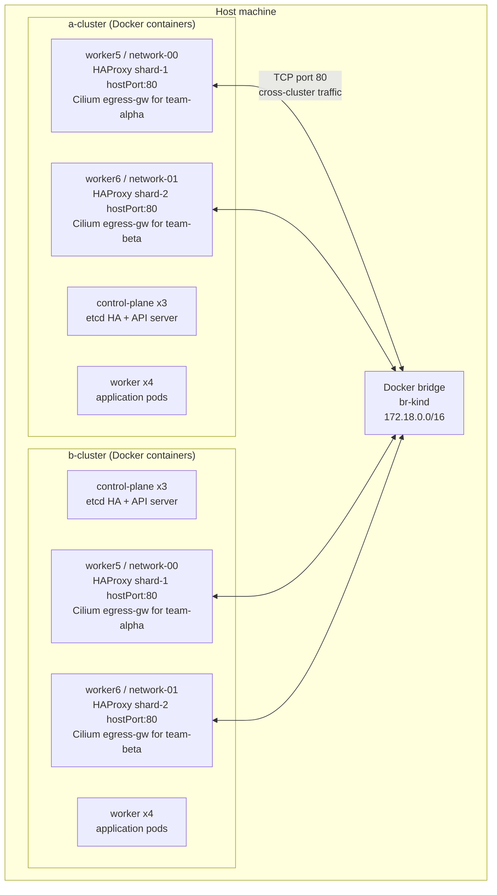
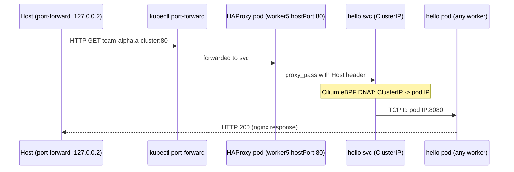
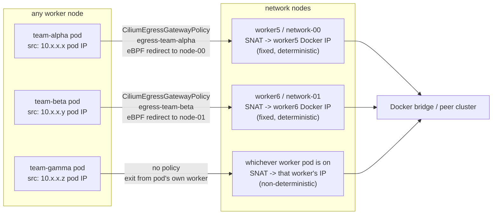
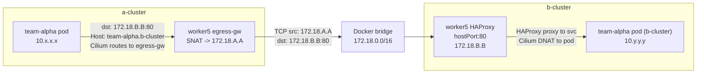

# Cluster Architecture

## Overview

Two identical Kind clusters (`a-cluster`, `b-cluster`) run in Docker on the same host. Each has 9 nodes. The clusters communicate via Docker bridge IPs — raw TCP with no overlay tunnel between clusters.

## Node Layout (per cluster)

| Kind name | Role | Labels | Taint | Purpose |
|-----------|------|--------|-------|---------|
| `<cluster>-control-plane` | control-plane | — | — | etcd + API server |
| `<cluster>-control-plane2` | control-plane | — | — | etcd + API server |
| `<cluster>-control-plane3` | control-plane | — | — | etcd + API server |
| `<cluster>-worker` through `worker4` | worker | — | — | application pods |
| `<cluster>-worker5` | worker | `network-index=0`, `node-role=network` | `role=network:NoSchedule` | HAProxy shard-1 + egress-gw for alpha |
| `<cluster>-worker6` | worker | `network-index=1`, `node-role=network` | `role=network:NoSchedule` | HAProxy shard-2 + egress-gw for beta |

Network nodes are tainted `role=network:NoSchedule`. Only HAProxy pods (which carry an explicit toleration) are scheduled there — application pods never land on network nodes.

## CNI: Cilium 1.16.5

Cilium runs in full kube-proxy replacement mode.

| Feature | Value | Effect |
|---------|-------|--------|
| `kubeProxyReplacement` | `true` | All ClusterIP/NodePort handled in eBPF — no iptables rules |
| `egressGateway.enabled` | `true` | Enables `CiliumEgressGatewayPolicy` CRD |
| `bpf.masquerade` | `true` | eBPF-level masquerade (required by egressGateway) |
| `ipam.mode` | `kubernetes` | Pod CIDRs allocated per-node by Kubernetes |
| `hubble.relay.enabled` | `true` | Centralized L3/L4 flow aggregation |
| `hubble.ui.enabled` | `true` | Web UI: flow graph, service map, DNS, drop reasons |

## HAProxy Sharded Ingress

Two HAProxy controllers, each a DaemonSet pinned to one network node via `nodeSelector`.

| Shard | Node | `network-index` | `ingressClass` | Watches | hostPort |
|-------|------|----------------|----------------|---------|----------|
| shard-1 | worker5 (network-00) | `0` | `haproxy-shard-1` | `team-alpha` | 80 |
| shard-2 | worker6 (network-01) | `1` | `haproxy-shard-2` | `team-beta`, `team-gamma` | 80 |

Each shard binds port 80 directly on the node's `eth0` via `hostPort` — not via NodePort or LoadBalancer. This makes the ingress path deterministic and observable: all traffic for `team-alpha` enters through worker5's eth0.

## Egress Gateway Policies

Two `CiliumEgressGatewayPolicy` resources pin external traffic from `team-alpha` and `team-beta` to specific network nodes. `team-gamma` has no policy.

The egress gateway works at eBPF level: Cilium intercepts packets destined for external IPs, redirects them through the designated gateway node, which then masquerades the source to its own IP before forwarding.

**Observable contrast**: Capture on worker5 to see all team-alpha external traffic SNATed to worker5's IP. Capture on any worker to see team-gamma traffic exiting from whichever node the pod was scheduled on.

## Cross-Cluster Wiring

After both clusters are created, `setup-dual-cluster.sh` resolves each cluster's network node Docker bridge IPs and injects them into `peer-ingress` ConfigMaps in each namespace.

The `peer-ingress` ConfigMap in each namespace carries:
- `PEER_SHARD1` — Docker IP of the peer cluster's network-00 node
- `PEER_SHARD2` — Docker IP of the peer cluster's network-01 node
- `PEER_DOMAIN` — peer cluster name (e.g. `b-cluster`)

Pods use `curl -H "Host: team-alpha.b-cluster" http://$PEER_SHARD1/` to reach the peer.

## Port-Forward Setup

Since clusters run in Docker, host access goes through `kubectl port-forward` to loopback aliases.

| Loopback alias | Cluster | Forwards to | /etc/hosts entries |
|---------------|---------|-------------|-------------------|
| `127.0.0.2:80` | a-cluster | `svc/haproxy-shard-1` | `team-alpha.a-cluster traffic-alpha.a-cluster` |
| `127.0.0.3:80` | a-cluster | `svc/haproxy-shard-2` | `team-beta.a-cluster team-gamma.a-cluster traffic-beta.a-cluster traffic-gamma.a-cluster` |
| `127.0.0.4:80` | b-cluster | `svc/haproxy-shard-1` | `team-alpha.b-cluster traffic-alpha.b-cluster` |
| `127.0.0.5:80` | b-cluster | `svc/haproxy-shard-2` | `team-beta.b-cluster team-gamma.b-cluster traffic-beta.b-cluster traffic-gamma.b-cluster` |
| `127.0.0.1:12000` | a-cluster | `svc/hubble-ui` | — |
| `127.0.0.1:12001` | b-cluster | `svc/hubble-ui` | — |
