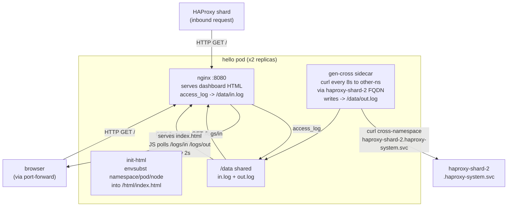
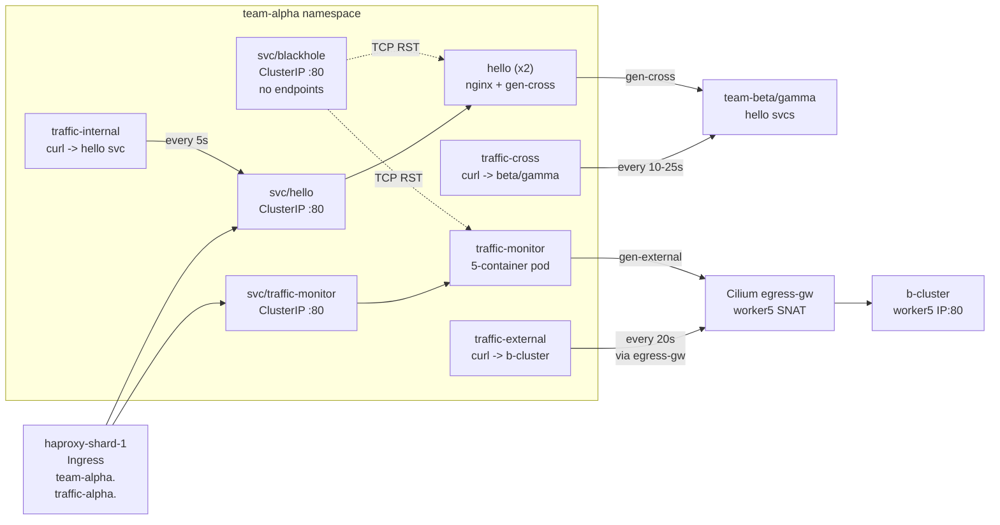
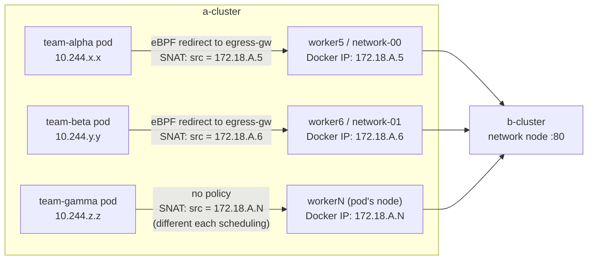

# Namespaces

Each cluster has three application namespaces: `team-alpha`, `team-beta`, `team-gamma`. They are structurally identical but differ in ingress shard assignment and egress gateway policy — these differences are the core of the observability POC.

## Namespace Comparison

| | `team-alpha` | `team-beta` | `team-gamma` |
|--|-------------|-------------|--------------|
| **Ingress shard** | `haproxy-shard-1` | `haproxy-shard-2` | `haproxy-shard-2` |
| **Ingress node** | worker5 (network-00) | worker6 (network-01) | worker6 (network-01) |
| **Egress policy** | `egress-team-alpha` | `egress-team-beta` | none |
| **Egress node** | worker5 (network-00) — fixed | worker6 (network-01) — fixed | any worker — non-deterministic |
| **egress-group label** | `alpha` | `beta` | (none) |

The `egress-group` label on the namespace is the selector used by `CiliumEgressGatewayPolicy`. `team-gamma` has no label and therefore no policy — its pods egress from whichever worker they happen to be scheduled on.

## Workloads (same in every namespace)

| Deployment | Replicas | Containers | Purpose |
|------------|----------|------------|---------|
| `hello` | 2 | nginx + gen-cross | nginx app with live traffic dashboard; gen-cross sidecar generates outbound cross-ns traffic |
| `traffic-monitor` | 1 | nginx + gen-internal + gen-cross + gen-external + gen-chaos | Full traffic dashboard with 4 dedicated generator streams |
| `traffic-internal` | 1 | curl | Standalone: curl to same-namespace hello svc every 5s (stdout only) |
| `traffic-cross` | 1 | curl | Standalone: curl to other namespaces' hello svc every 10-25s (stdout only) |
| `traffic-external` | 1 | curl | Standalone: curl to peer cluster shard IP every 20s (stdout only) |

| Service | Selector matches | Purpose |
|---------|-----------------|---------|
| `hello` | `app=hello` | ClusterIP for hello pods |
| `traffic-monitor` | `app=traffic-monitor` | ClusterIP for traffic-monitor pod |
| `blackhole` | `app=blackhole-nonexistent` | No pods match — Cilium sends TCP RST immediately |

## hello Deployment

Two nginx replicas each serving a live traffic dashboard. An init container renders the HTML with namespace/pod/node identity via `envsubst`. A `gen-cross` sidecar generates outbound traffic and writes to a shared `/data/out.log`. Nginx logs incoming requests to `/data/in.log`.



The dashboard renders three color-coded panels:
- **Incoming**: nginx access log lines — remote IP, request path, HTTP status code
- **Outgoing**: gen-cross curl results — target namespace, HTTP status or error
- **Combined**: both streams merged by timestamp

The gen-cross sidecar alternates targets (team-beta / team-gamma) and occasionally:
- Sends a request with `via=peer` to the peer cluster (every 5th request if PEER_SHARD2 is set)
- Sends to `blackhole.<ns>.svc.cluster.local` (every 6th — produces TCP RST)
- Sends to `<shard>/chaos-not-found` (every 4th — produces HTTP 404)

## traffic-monitor Deployment

One pod with five containers sharing a `/data/out.log` volume. Provides a complete picture of all traffic types originating from the namespace.

```mermaid
graph TD
    subgraph "traffic-monitor pod"
        GI["gen-internal\nevery 5s\nhello.<ns>.svc.cluster.local"]
        GX2["gen-cross\nevery 10-25s\nhello.<other-ns>.svc.cluster.local"]
        GE["gen-external\nevery 20s\nPEER_SHARD1 or PEER_SHARD2\nHost: team-<ns>.<peer-domain>"]
        GCH["gen-chaos\nevery 7s\nblackhole svc / 404 path / normal"]
        NX2["nginx :8080\nserves same dashboard\nreads /data/out.log"]
        VOL2["/data/out.log\nshared by all generators"]
    end

    SAME_NS["hello.<ns>.svc.cluster.local\n(ClusterIP DNAT to pod)"] <-- GI
    OTHER_NS["hello.<other-ns>.svc.cluster.local\n(cross-namespace ClusterIP)"] <-- GX2
    PEER["peer cluster shard IP\n(routed via egress-gw for alpha/beta)"] <-- GE
    BH["blackhole.<ns>.svc\n(no endpoints -> Cilium RST)"] <-- GCH
    GI --> VOL2
    GX2 --> VOL2
    GE --> VOL2
    GCH --> VOL2
```

### gen-chaos pattern

gen-chaos increments a counter each iteration (every 7s) and cycles:

| Counter mod | Action | Expected result |
|-------------|--------|----------------|
| `% 6 == 0` | `curl blackhole.<ns>.svc.cluster.local` | TCP RST — Cilium, no endpoints |
| `% 4 == 0` | `curl http://<shard>/chaos-not-found` | HTTP 404 — HAProxy, path not matched |
| otherwise | `curl http://<shard>/` valid Host | HTTP 200 — normal cross-shard request |

## blackhole service

```yaml
# Selector matches a label that no pod carries.
# Cilium sees no ready endpoints and sends TCP RST immediately — no timeout.
selector:
  app: blackhole-nonexistent
```

Observable as SYN → RST in tcpdump (no three-way handshake). curl reports HTTP code `000` which the generators log as `refused`.

## team-alpha full map



## Differences between namespaces

### Egress path comparison (observable with tcpdump)



**alpha and beta**: source IP at `b-cluster` is always the same fixed network node IP. Any external observer or the destination cluster sees a stable source.

**gamma**: source IP varies depending on which worker the pod is scheduled on. After a pod restart or rescheduling, the source IP changes — observable in Hubble and in HAProxy access logs on b-cluster.
