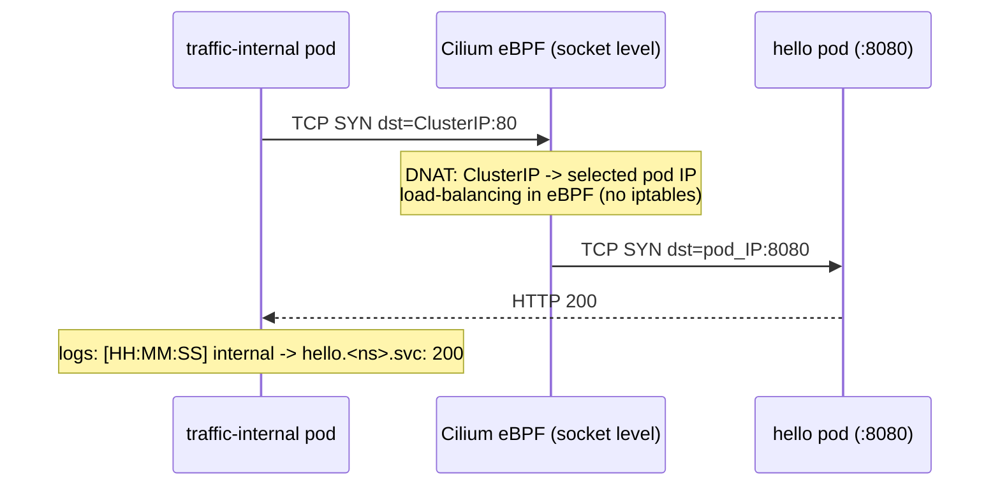
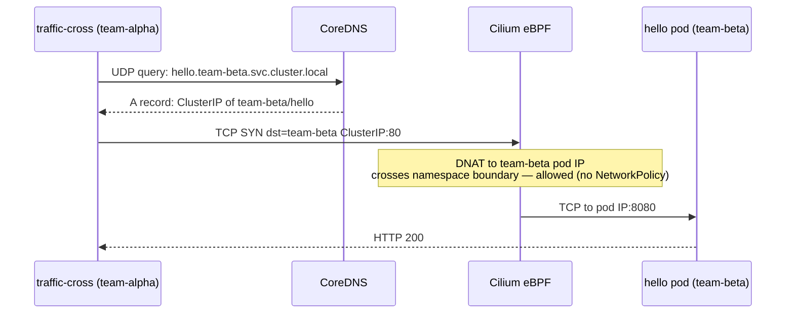
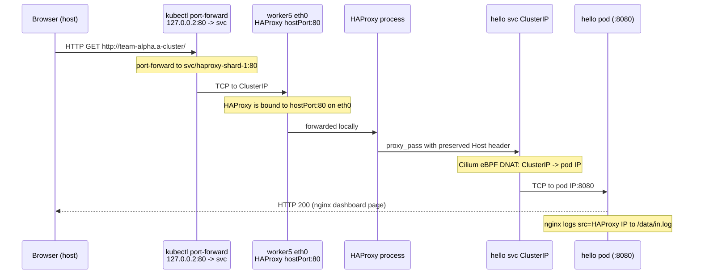
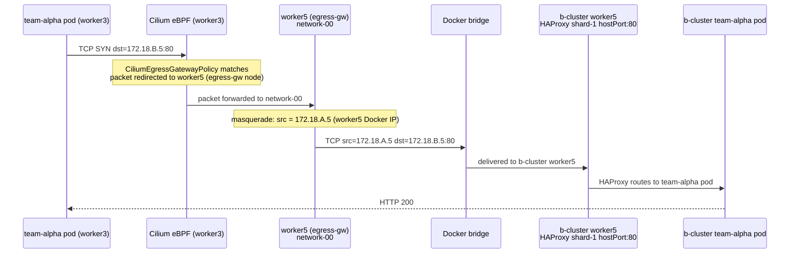
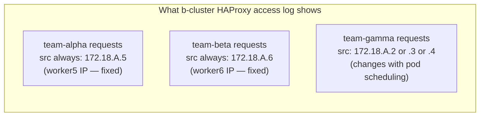
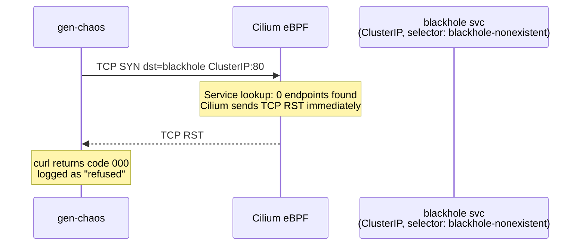
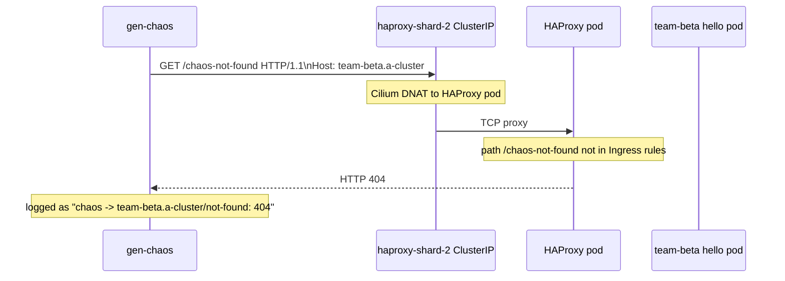
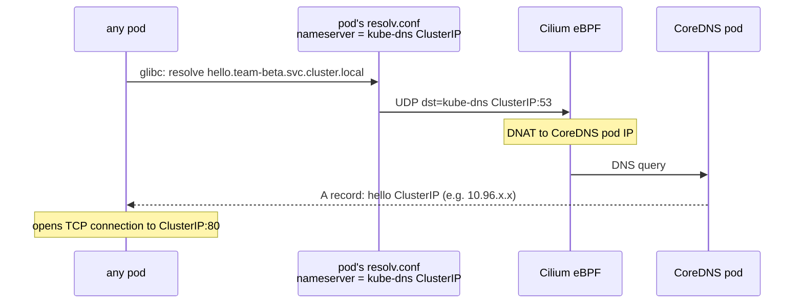
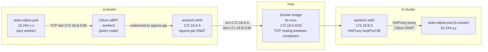

# Traffic Flows

All communication flows present in the environment, their source, destination, frequency, and what to look for when capturing.

## Flow Inventory

| # | Flow type | Source | Destination | Protocol | Frequency |
|---|-----------|--------|-------------|----------|-----------|
| 1 | Intra-namespace pod → ClusterIP svc | `traffic-internal` / `gen-internal` | `hello.<ns>.svc.cluster.local` | TCP HTTP | 5s |
| 2 | Cross-namespace pod → ClusterIP svc | `traffic-cross` / `gen-cross` | `hello.<other-ns>.svc.cluster.local` | TCP HTTP | 10–25s |
| 3 | Ingress: host → pod (via HAProxy) | browser / port-forward | `hello` or `traffic-monitor` pod | TCP HTTP | on demand |
| 4 | Egress pinned (alpha/beta) → peer cluster | `traffic-external` / `gen-external` | peer cluster shard hostPort:80 | TCP HTTP | 20s |
| 5 | Egress unpinned (gamma) → peer cluster | `traffic-external` / `gen-external` | peer cluster shard hostPort:80 | TCP HTTP | 20s |
| 6 | TCP RST — blackhole service | `gen-chaos` / `gen-cross` | `blackhole.<ns>.svc.cluster.local` | TCP | ~42s |
| 7 | HTTP 404 chaos | `gen-chaos` / `gen-cross` | `<shard>/<ns>/chaos-not-found` via ClusterIP | HTTP | ~28s |
| 8 | DNS — service resolution | every pod, every request | CoreDNS (`kube-dns` svc `:53`) | UDP/TCP | per curl |
| 9 | Cross-cluster TCP (Docker bridge) | network node after egress-gw SNAT | peer cluster network node hostPort:80 | TCP | 20s |

---

## Flow 1: Intra-namespace pod to ClusterIP service

Same-namespace traffic. Cilium eBPF replaces kube-proxy: there are no iptables NAT rules — DNAT happens in eBPF at the socket layer.



**Capture point**: worker node veth or pod netns — will see pod IP after DNAT, not ClusterIP.

---

## Flow 2: Cross-namespace pod to ClusterIP service

Traffic crossing the namespace boundary. No `NetworkPolicy` exists so Cilium allows all. DNS resolves a FQDN in another namespace.



**Capture point**: Hubble UI — filter `source namespace=team-alpha` to see outbound, or `destination namespace=team-beta` to see inbound. In Hubble the DNAT is transparent — flows show pod-to-pod.

---

## Flow 3: Ingress path (host browser to pod)

The full path from the developer's browser through port-forward and HAProxy into a pod.



**What you'll see in nginx**: the source IP in `in.log` is the HAProxy pod's IP (not your browser IP). HAProxy adds `X-Forwarded-For` with the original client IP but nginx doesn't log it by default.

**Capture on worker5**: `oc debug node/a-cluster-worker5 -- chroot /host tcpdump -i eth0 tcp port 80` — shows incoming TCP from the port-forward address and HAProxy's proxy connections to pod IPs.

---

## Flow 4 & 5: Egress to peer cluster (with and without egress gateway)

This is the key demonstration flow distinguishing the three namespaces.



For **team-gamma** (no egress policy), step 3 is skipped — the packet exits from worker3 directly with src=worker3's Docker IP. If the pod is rescheduled to worker2, the source IP changes.



---

## Flow 6: TCP RST from blackhole service

Cilium detects a service with no ready endpoints and responds with TCP RST without forwarding to any backend. This happens in eBPF — no TCP handshake completes.



**What you'll see in tcpdump**:
```
# SYN
10:00:01.123 IP pod_IP.random_port > ClusterIP.80: Flags [S]
# Immediate RST (no SYN-ACK)
10:00:01.124 IP ClusterIP.80 > pod_IP.random_port: Flags [R.]
```

**Hubble**: shows `verdict=DROPPED` with `reason=policy-denied` or `no-endpoint` depending on Cilium version. The `blackhole` service name appears in the destination field.

---

## Flow 7: HTTP 404 chaos

gen-chaos sends a valid HTTP request to a real HAProxy shard but uses a path (`/chaos-not-found`) that doesn't match any Ingress rule. HAProxy returns 404.



**Observable at**: HAProxy access log — `kubectl logs -n haproxy-system -l app.kubernetes.io/name=kubernetes-ingress`

---

## Flow 8: DNS resolution

Every service-name curl call begins with a DNS query. CoreDNS runs as a deployment in `kube-system` and responds to `*.svc.cluster.local` queries.



**High frequency**: every curl loop re-resolves unless glibc caches the record (TTL 5s in CoreDNS). With ~6 generators per namespace and 3 namespaces per cluster, expect 30+ DNS queries per minute.

**Capture**: `oc debug node/a-cluster-worker -- chroot /host tcpdump -i any udp port 53` — shows all DNS queries from pods scheduled on that node.

---

## Flow 9: Cross-cluster TCP over Docker bridge

This flow is the combination of egress-gw SNAT (Flows 4/5) with the Docker bridge routing between cluster nodes.



**Capture on host Docker bridge**:
```bash
BRIDGE=$(docker network ls --filter name=kind --format '{{.ID}}' | cut -c1-12)
sudo tcpdump -i br-$BRIDGE -n tcp port 80
```

You will see TCP between two Docker IPs (`172.18.x.x` → `172.18.y.y:80`). The source IP reveals which network node is acting as egress gateway for that namespace.
